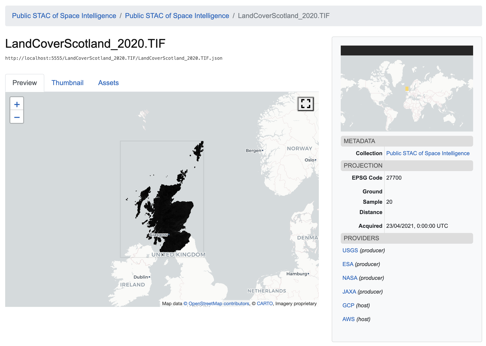

# STAC-SI(-CRED)
#### SpatioTemporal Asset Catalog for Space Intelligence

Create a STAC of Space Intelligence data. The data is stored in a public GCP bucket `gs://stac-si`, for private data we use `gs://stac-si-cred`. 

We'll translate existing metadata about each dataset to STAC information, utilizing the `eo`, `view`, and `proj` extensions. Finally we'll write the STAC catalog to json, allowing us to use [stac-browser](https://github.com/radiantearth/stac-browser) to preview the images.

#### Functions
- Upload tif to gcloud bucket
- Auto translate tif to COG before upload to gcloud
- Create stac collection
- Index `gs` data into collection
- Validate and save collection
- Host collection.json in public repo

#### WiP / TODO:
- seamless private data access ~ CORS configuration
- multi-band ingestion flow (item can hold multiple bands, stored as separate assets)

Credits to [sat-stac-landsat](https://github.com/sat-utils/sat-stac-landsat) and [pystac tutorial](https://github.com/stac-utils/pystac/blob/main/docs/tutorials/creating-a-landsat-stac.ipynb).